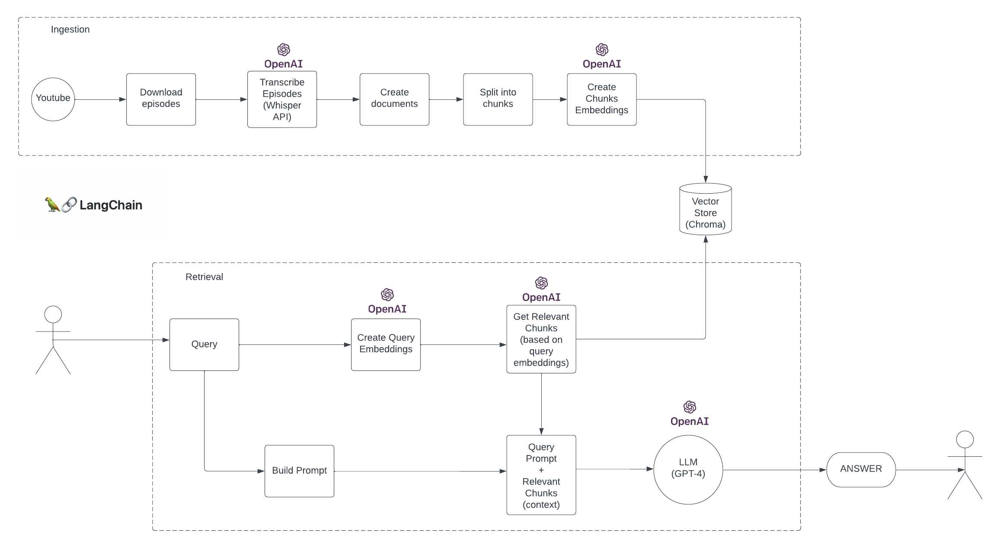

## RebordGPT

Usa inteligencia artificial basada en GPT-4 para buscar episodios del Metodo Rebord

### Detalles tecnicos
* Langchain / OpenAI
* Chroma (vector store)
* FastAPI
* NextJS

### Embeddings

Este proyecto contiene las transcripciones de los primeros 54 episodios del Metodo Rebord hechas con Whisper, se encuentran en `ingestion/transcriptions` 

Se generaron embeddings de estas transcripciones usando OpenAI y Chroma como base de datos de vectores.
Chroma corre localmente con este proyecto, y la base de datos se encuentra en el directorio `db`

[Langchain QA docs](https://python.langchain.com/docs/use_cases/question_answering/)

### Frontend - NextJS
El frontend se ha hecho de una manera estatica, hay que generar el html de antemano para que sea servido por FastAPI. Hay que ejecutar el siguiente comando `npm run build` la primera vez que se clona el proyecto y cada vez que se hace un cambio en el frontend.

### Backend - FastAPI

Para correr el servidor ejecutar `uvicorn main:app --reload` \
Los endpoints de la api empiezan con `/api/` \
El frontend se sirve desde el root path `/`
