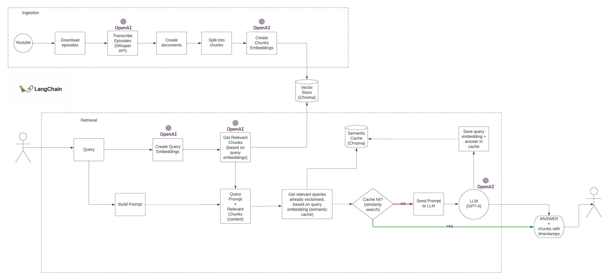

## RebordGPT

Usa inteligencia artificial basada en GPT-4 para buscar episodios del Metodo Rebord

## Video Tutorial en YouTube
[![[#95] Hacemos una app paso a paso con GPT4, LangChain, Whisper, y más](https://img.youtube.com/vi/1Rpn4lrshlo/mqdefault.jpg)](https://www.youtube.com/watch?v=1Rpn4lrshlo)

### Detalles tecnicos
* Langchain / OpenAI
* Chroma (vector store)
* FastAPI
* NextJS

Se necesita python `>=3.9`. Para instalar las dependencias, crear un entorno virtual y ejecutar `pip install -r requirements.txt`

**No olvidarse de crear un archivo `.env` en el directorio root y agregar el token de OpenAI en la variable de entorno `OPENAI_API_KEY` en la forma `OPENAI_API_KEY=<token>`**

### Embeddings

Este proyecto contiene las transcripciones de los primeros 68 episodios del Metodo Rebord hechas con Whisper, se encuentran en `ingestion/transcriptions` 

Se generaron embeddings de estas transcripciones usando OpenAI y Chroma como base de datos de vectores.
Chroma corre localmente con este proyecto, y la base de datos se encuentra en el directorio `db`

### Semantic cache

Se ha implementado un *semantic cache*, vectorizando las preguntas y guardando los embeddings usando chroma, en el directorio `cache_chroma`. De esta forma, para preguntas con significado semantico similar, no se llamara al LLM y se usara la respuesta cacheada, mejorando los tiempos de respuesta y optimizando costos de llamadas a la API de OpenAI.
Langchain actualmente no soporta semantic caching usando Chroma, por lo que en este proyecto hemos creado una nueva clase `ChromaSemanticCache` que implementa la interfas `BaseCache` de Langchain.

[Langchain QA docs](https://python.langchain.com/docs/use_cases/question_answering/)

### Frontend - NextJS
El frontend se ha hecho de una manera estatica, hay que generar el html de antemano para que sea servido por FastAPI. Hay que ejecutar el siguiente comando `npm run build` cada vez que se hace un cambio en el frontend. El repo contiene la version estatica del frontend por lo que no es necesario ejecutar este comando cuando se clona el proyecto.

### Backend - FastAPI

Para correr el servidor ejecutar `uvicorn main:app --reload` \
Los endpoints de la api empiezan con `/api/` \
El frontend se sirve desde el root path `/`
